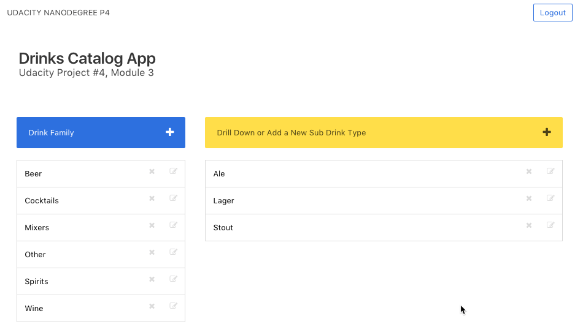
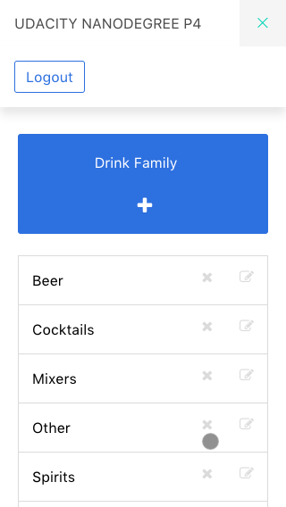

# Module 3 Project 4 (Drinks Catalog)

## Description

This application is a drinks app. It allows you to capture and categorize your favourite drinks.

### Examples: 
- Beer, Beer SubTypes, 
- Wine, Wine Color, Sparkling
- Cocktails
- etc..

## Notes
- This project was built for python 2.7.x. It currently has some bugs with Python3 (Social Login)
- It uses the BulmaCSS framework and has a responsive view as well. See below.

## Installation

- Clone this repo
- To setup DB: run `python database_setup.py`
- To populate DB with samlpe data (optional) run `python sample_data.py`
- To start the app, type: `python application.py`
- Navigate to `localhost:5000` in your web browser.

